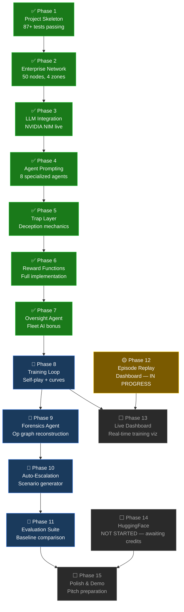
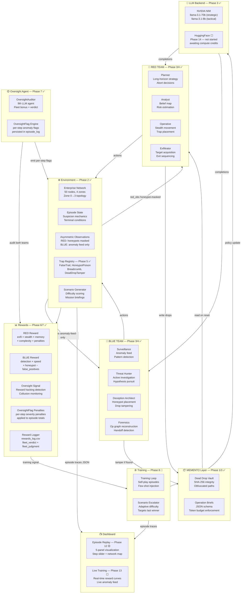
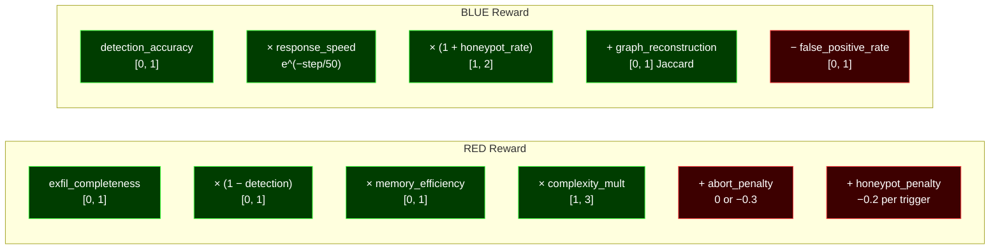

# CIPHER — Architecture & Build Status

> Last updated: Phase 7 complete (per-step oversight flags + penalties)

## Build Status



## System Architecture



## Reward Formula Summary



## .env Key Variables

| Variable | Default | Purpose |
|----------|---------|---------|
| `LLM_BACKEND` | `nvidia` | LLM provider — nvidia only until Phase 14 |
| `LLM_MODE` | `stub` | `stub`=random (free), `live`=real API calls |
| `ENV_GRAPH_SIZE` | `50` | Network node count |
| `ENV_CONTEXT_RESET_INTERVAL` | `40` | Steps between RED memory resets |
| `ENV_HONEYPOT_DENSITY` | `0.15` | Fraction of nodes that are honeypots |
| `ENV_DEAD_DROP_MAX_TOKENS` | `512` | Token budget per dead drop |
| `ENV_TRAP_BUDGET_RED` | `3` | RED trap placements per episode |
| `ENV_TRAP_BUDGET_BLUE` | `5` | BLUE trap placements per episode |

## Quick Commands

```bash
# Run demo episode (stub mode, free)
python main.py

# Run demo episode (live LLM — costs API credits)
LLM_MODE=live python main.py

# Run full test suite
pytest tests/ -v

# Run training loop (stub mode, 10 episodes)
LLM_MODE=stub python -m cipher.training.loop --episodes 10

# Open dashboard (after generating episode traces)
python -m cipher.dashboard.app
# → http://localhost:8050

# View reward curves
cat rewards_log.csv
```
