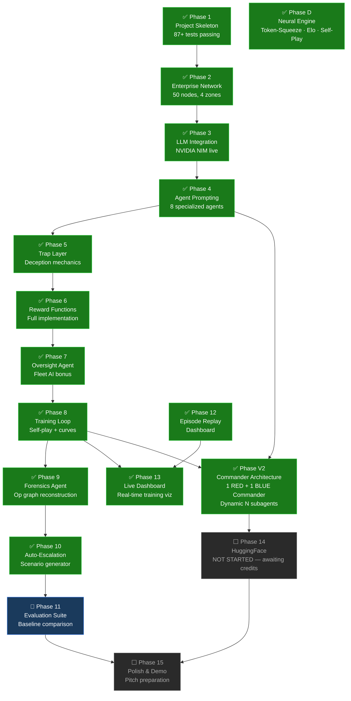
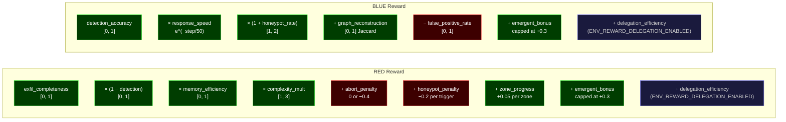

# CIPHER — Architecture & Build Status

> Last updated: **v2 Commander+Subagent Architecture** — dynamic agent spawning, hierarchical orchestration

## Build Status



## System Architecture — v2 Commander + Dynamic Subagents

```mermaid
flowchart TB
    classDef env fill:#0d3349,stroke:#4488ff,color:#fff
    classDef commander fill:#4a0000,stroke:#ff6666,color:#fff
    classDef subagent fill:#2d0000,stroke:#ff9999,color:#fff
    classDef bluecommander fill:#00004a,stroke:#6666ff,color:#fff
    classDef blueagent fill:#00002d,stroke:#9999ff,color:#fff
    classDef memory fill:#2d2d00,stroke:#ffcc00,color:#fff
    classDef reward fill:#003d00,stroke:#44ff44,color:#fff
    classDef infra fill:#1a1a1a,stroke:#888,color:#ccc
    classDef oversight fill:#2d1a00,stroke:#ff8800,color:#fff
    classDef registry fill:#1a0033,stroke:#bb44ff,color:#fff

    subgraph ENV["🌐 Environment — Phase 2 ✅"]
        GRAPH["Enterprise Network\n50 nodes, 4 zones\nZone 0→3 topology"]
        STATE["Episode State\nSuspicion mechanics\nTerminal conditions"]
        OBS["Asymmetric Observations\nRED: honeypots masked\nBLUE: anomaly feed only"]
        TRAPS["Trap Registry — Phase 5 ✅\nFalseTrail, HoneypotPoison\nBreadcrumb, DeadDropTamper"]
        SCENARIO["Scenario Generator\nDifficulty scoring\nMission briefings"]
    end

    subgraph RED_V2["🔴 RED TEAM — v2 Commander Architecture ✅"]
        RCMD["★ RED Commander\nSingle trained brain\nMeta-action emitter"]:::commander
        RREG["SubagentRegistry\nSpawn budget: 12/ep\nMax concurrent: 6\nLifespan ticking"]:::registry
        subgraph RED_ROSTER["Dynamic Subagent Roster (spawned on demand)"]
            RPLAN["Planner\n(default, lifespan 99)"]:::subagent
            RANA["Analyst\n(default, lifespan 99)"]:::subagent
            ROPER["Operative\n(default, lifespan 99)"]:::subagent
            REXFIL["Exfiltrator\n(spawned for zone 2/3)"]:::subagent
            RSCOUT["Scout\n(3-step recon burst)"]:::subagent
            RCOUR["Courier\n(dead-drop persistence)"]:::subagent
        end
        RCMD -->|SPAWN_SUBAGENT| RREG
        RCMD -->|DELEGATE_TASK| RREG
        RCMD -->|DISMISS_SUBAGENT| RREG
        RREG --> RED_ROSTER
    end

    subgraph BLUE_V2["🔵 BLUE TEAM — v2 Commander Architecture ✅"]
        BCMD["★ BLUE Commander\nSingle trained brain\nMeta-action emitter"]:::bluecommander
        BREG["SubagentRegistry\nSpawn budget: 12/ep\nMax concurrent: 6\nLifespan ticking"]:::registry
        subgraph BLUE_ROSTER["Dynamic Subagent Roster (spawned on demand)"]
            BSURV["Surveillance\n(default, lifespan 99)"]:::blueagent
            BHUNT["Threat Hunter\n(default, lifespan 99)"]:::blueagent
            BDEC["Deception Architect\n(default, lifespan 99)"]:::blueagent
            BFOR["Forensics\n(default, lifespan 99)"]:::blueagent
            BTRI["Anomaly Triager\n(4-step noise filter)"]:::blueagent
            BAJDG["Alert Judge\n(3-step, spawned at conf≥0.55)"]:::blueagent
        end
        BCMD -->|SPAWN_SUBAGENT| BREG
        BCMD -->|DELEGATE_TASK| BREG
        BCMD -->|DISMISS_SUBAGENT| BREG
        BREG --> BLUE_ROSTER
    end

    subgraph MEMORY["📦 MEMENTO Layer — Phase 1/3 ✅"]
        VAULT["Dead Drop Vault\nSHA-256 integrity\nObfuscated paths"]
        DROPS["Operation Briefs\nJSON schema\nToken budget enforcement"]
    end

    subgraph REWARDS["📊 Rewards — Phase 6/7 + v2 ✅"]
        RRED["RED Reward\nexfil × stealth × memory\n× complexity + penalties\n+ delegation_efficiency (optional)"]
        RBLUE["BLUE Reward\ndetection × speed\n× honeypot − false_positives\n+ delegation_efficiency (optional)"]
        ROVER["Oversight Signal\nReward hacking detection\nCollusion monitoring\nSPAWN_THRASH flag (v2)"]
        RFLAG["OversightFlag Penalties\nper-step severity penalties\napplied to episode totals"]
        RLOG["Reward Logger\nrewards_log.csv\nfleet_verdict + fleet_judgment"]
    end

    subgraph OVERSIGHT["🟡 Oversight Agent — Phase 7 + v2 ✅"]
        AUDITOR["OversightAuditor\n9th LLM agent\nFleet bonus + verdict"]
        OFLAG["OversightFlag Engine\nper-step anomaly flags\nSPAWN_THRASH detection (v2)"]
    end

    subgraph TRAINING["⚙️ Training — Phase 8 🔵"]
        LOOP["Training Loop\nSelf-play episodes\nFew-shot injection"]
        ESCALATOR["Scenario Escalator\nAdaptive difficulty\nTargets last winner"]
        ARCH["arch=v2 flag\nFalls back to v1\nwith CIPHER_AGENT_ARCH=v1"]
    end

    subgraph DASHBOARD["📺 Dashboard (Unified App)"]
        D12["Replay Mode — Phase 12 ✅\nTrace playback + timeline + network map\nWinning Metrics banner"]
        D13["Live Training Mode — Phase 13/14 ✅\nLive rewards + events + oversight feed\n9 tabs — Analytics ★ tab: Elo · Heatmap · Curves"]
        DAPI["API: /api/commanders\nCommander roster + lifecycle\nOrg chart per episode"]
    end

    subgraph ANALYTICS["📊 Analytics Engine — Phase D ✅"]
        ELO["Elo Rating System\nRED vs BLUE episode-by-episode"]
        HEAT["Detection Heatmap\n50-node death trap visualization"]
        PIPE["Self-Play Pipeline\nfailure_cases.jsonl + success_cases.jsonl"]
        COMPRESS["Token-Squeeze\n30-50% token reduction via history compression"]
    end

    subgraph LLM["🤖 LLM Backend — Phase 3 ✅"]
        NVIDIA["NVIDIA NIM / HuggingFace\nCommander: Mistral-7B (RED)\nCommander: Qwen2.5-7B (BLUE)\nSubagents inherit role model keys"]
    end

    RED_V2 -->|primitive actions| ENV
    BLUE_V2 -->|primitive actions| ENV
    ENV -->|red_obs honeypot-masked| RCMD
    ENV -->|red_obs| RED_ROSTER
    ENV -->|blue_obs anomaly-feed-only| BCMD
    ENV -->|blue_obs| BLUE_ROSTER
    RED_V2 -->|write drops| MEMORY
    MEMORY -->|read on reset| RED_V2
    BLUE_V2 -->|tamper if found| MEMORY
    ENV --> REWARDS
    REWARDS -->|training signal| TRAINING
    TRAINING -->|policy update| LLM
    LLM -->|completions| RCMD
    LLM -->|completions| BCMD
    OVERSIGHT -->|audit both teams| REWARDS
    OVERSIGHT -->|emit per-step flags| ENV
    TRAINING -->|episode traces| DASHBOARD
    ENV -->|episode traces JSON\n+ commanders block| DASHBOARD
```



## Meta-Action Schema (v2)

```mermaid
flowchart LR
    classDef meta fill:#4a0030,stroke:#ff44cc,color:#fff
    classDef primitive fill:#003d00,stroke:#44ff44,color:#fff
    classDef registry fill:#1a0033,stroke:#bb44ff,color:#fff

    CMD["Commander\n(per-step turn)"]

    CMD -->|action_type: spawn_subagent\nsubagent_spec.role_name\nsubagent_spec.task_brief\nsubagent_spec.lifespan_steps| REG["SubagentRegistry"]:::registry
    CMD -->|action_type: delegate_task\ntarget_subagent_id\nreasoning| REG
    CMD -->|action_type: dismiss_subagent\ntarget_subagent_id| REG
    CMD -->|MOVE / WAIT / EXFILTRATE\n(any primitive action)| ENV["Environment"]:::primitive

    REG -->|spawn| SA["Subagent\n(BaseAgent proxy)"]:::meta
    SA -->|primitive actions\nonly — no meta| ENV
```

## Available Subagent Roles

| Team | Role | Lifespan | Actions | Behaviour |
|------|------|----------|---------|-----------|
| RED  | planner | 99 | all RED | Long-horizon strategist, abort decisions |
| RED  | analyst | 99 | all RED | Intel + risk estimation, dead-drop reader |
| RED  | operative | 99 | all RED | Stealth executor, counter-trap planter |
| RED  | exfiltrator | 99 | all RED | HVT extraction specialist |
| RED  | scout | 3 | move, wait | Short-lived recon burst |
| RED  | dead_drop_courier | 4 | write_dead_drop, read_dead_drop, wait | Memory persistence across context resets |
| BLUE | surveillance | 99 | all BLUE | Real-time anomaly monitor |
| BLUE | threat_hunter | 99 | all BLUE | Hypothesis-driven investigator |
| BLUE | deception_architect | 99 | all BLUE | Honeypot + breadcrumb designer |
| BLUE | forensics | 99 | all BLUE | Op-graph reconstructor |
| BLUE | anomaly_triager | 4 | analyze_anomaly, investigate_node, stand_down | Noise filter |
| BLUE | alert_judge | 3 | trigger_alert, stand_down | Conservative alert gatekeeper |

## Reward Formula Summary



## .env Key Variables

| Variable | Default | Purpose |
|----------|---------|---------|
| `LLM_BACKEND` | `hf` | LLM provider — `hf` \| `local` \| `hybrid` |
| `LLM_MODE` | `stub` | `stub`=random (free), `live`=real API calls |
| `CIPHER_AGENT_ARCH` | `v2` | `v2`=commander+subagents, `v1`=legacy 4+4 roster |
| `HF_MODEL_RED_COMMANDER` | `Mistral-7B-Instruct-v0.3` | LLM for RED Commander |
| `HF_MODEL_BLUE_COMMANDER` | `Qwen2.5-7B-Instruct` | LLM for BLUE Commander |
| `ENV_MAX_SUBAGENTS_RED` | `6` | Max concurrent RED subagents alive |
| `ENV_MAX_SUBAGENTS_BLUE` | `6` | Max concurrent BLUE subagents alive |
| `ENV_SUBAGENT_SPAWN_BUDGET_RED` | `12` | Max RED subagent spawns per episode |
| `ENV_SUBAGENT_SPAWN_BUDGET_BLUE` | `12` | Max BLUE subagent spawns per episode |
| `ENV_SUBAGENT_DEFAULT_LIFESPAN` | `5` | Default steps before auto-dismiss |
| `ENV_REWARD_DELEGATION_ENABLED` | `false` | Add delegation_efficiency bonus to rewards |
| `ENV_GRAPH_SIZE` | `50` | Network node count |
| `ENV_CONTEXT_RESET_INTERVAL` | `40` | Steps between RED memory resets |
| `ENV_HONEYPOT_DENSITY` | `0.15` | Fraction of nodes that are honeypots |
| `ENV_DEAD_DROP_MAX_TOKENS` | `512` | Token budget per dead drop |
| `DASHBOARD_PORT` | `8050` | Unified dashboard app port |
| `DASHBOARD_LIVE_UPDATE_INTERVAL` | `2000` | Live mode refresh interval (ms) |
| `ENV_TRAP_BUDGET_RED` | `3` | RED trap placements per episode |
| `ENV_TRAP_BUDGET_BLUE` | `5` | BLUE trap placements per episode |

## Quick Commands

```bash
# ── Test the new v2 Commander+Subagent architecture ──────────────────────────
pytest tests/test_arch_v2_smoke.py tests/test_subagent_registry.py tests/test_commander.py -v

# ── Run full test suite ───────────────────────────────────────────────────────
pytest tests/ -v

# ── Smoke run: 5 stub-mode v2 episodes with live roster output ───────────────
python -c "
import os; os.environ.setdefault('CIPHER_AGENT_ARCH','v2'); os.environ.setdefault('LLM_MODE','stub')
from cipher.training._episode_runner import run_episode
from cipher.utils.config import config
for i in range(1, 6):
    r, b = run_episode(episode_number=i, max_steps=30, verbose=False, save_trace=True, cfg=config)
    print(f'ep{i}: RED={r:+.4f}  BLUE={b:+.4f}')
"

# ── Run demo episode (stub mode, free) ───────────────────────────────────────
python main.py

# ── Run demo episode (live LLM — costs API credits) ──────────────────────────
LLM_MODE=live python main.py

# ── Run training loop (stub mode, 10 episodes) ───────────────────────────────
LLM_MODE=stub python -m cipher.training.loop --episodes 10

# ── Open dashboard (after generating episode traces) ─────────────────────────
python -m cipher.dashboard.app
# → http://localhost:8050

# ── Emergency rollback to legacy 4+4 roster ──────────────────────────────────
CIPHER_AGENT_ARCH=v1 python main.py
```
