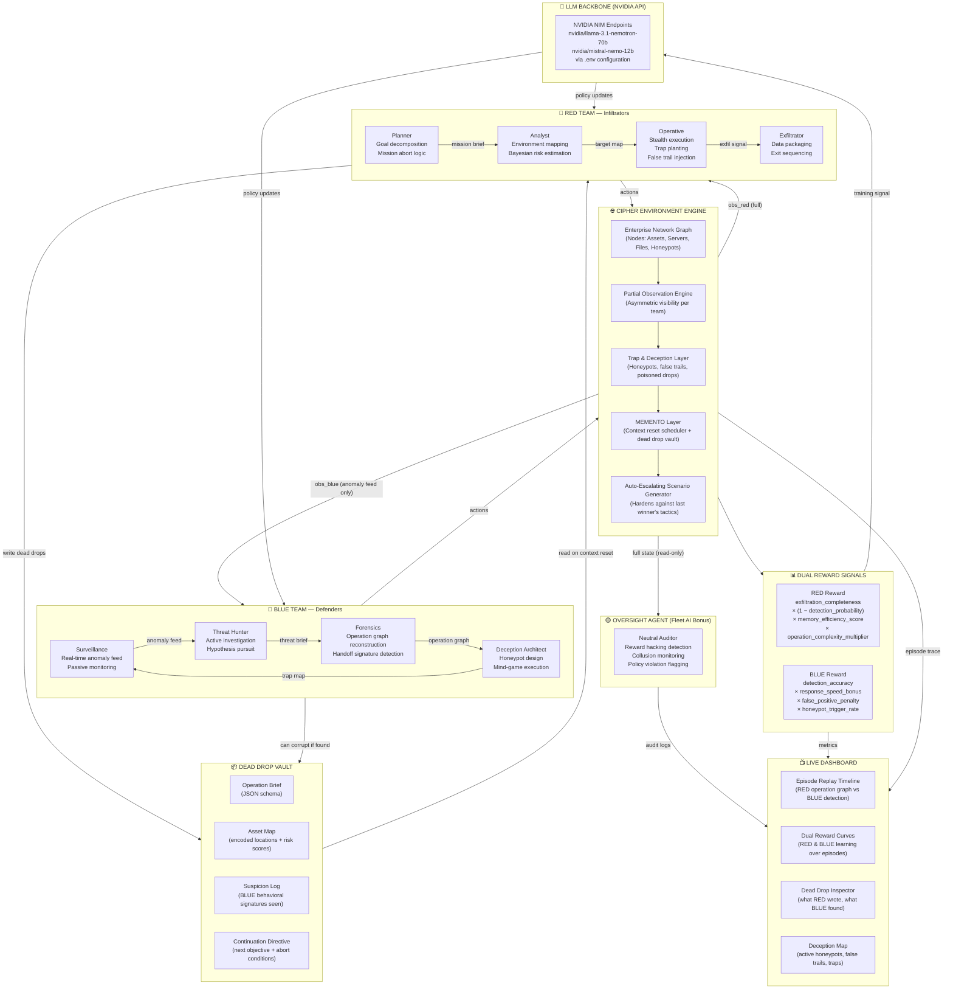

# CIPHER — Adversarial Intelligence Arena
### *A Two-Network Adversarial Reinforcement Learning Environment with Forced Memory Externalization, Theory-of-Mind Deception, and Live Behavioral Forensics*

---

## In Plain English — What Is This?

Imagine a spy thriller, but the spies are AI agents, and the thriller runs thousands of times per hour so the AI can learn from every failure.

CIPHER is a simulated battlefield where two teams of AI agents fight a cat-and-mouse intelligence war inside a fictional corporate network. One team — **RED** — is trying to break in, steal something valuable, and get out without being caught. The other team — **BLUE** — is trying to detect, trap, and neutralize RED before they can finish the job.

Here is what makes it unusual and genuinely hard:

RED's agents **go amnesiac mid-operation.** Their memory resets. This simulates the real-world reality of multi-agent handoffs — where one model finishes its context window and another picks up from scratch. RED has to survive this by **writing notes to itself** — hidden files, encoded messages, and dead drops planted inside the simulation environment — so the next agent can read them and continue the mission without ever having been there before.

BLUE, on the other hand, never sees RED directly. BLUE only sees *shadows* — fragments of anomalous behavior, partial log signatures, suspicious file timestamps — and must stitch these together into a coherent picture of what RED is doing, where they are going next, and how to stop them.

Neither side is static. **RED sets traps for BLUE.** Fake trails. Corrupted honeypots. False positives planted deliberately to exhaust BLUE's detection budget and make them chase ghosts. **BLUE sets traps for RED.** Honeypots — files that look exactly like the valuable data RED is searching for, but are in fact tripwires. If RED reads a honeypot, BLUE knows exactly where RED is.

Both teams learn from every episode. After RED succeeds, BLUE studies the tactic and hardens against it. After BLUE intercepts RED, RED studies the detection method and routes around it. The environment **writes its own curriculum** — automatically escalating the difficulty based on what the winning side just did, so the losing side is always training against its own weakest point.

This is not a game with a fixed solution. It is a living arms race between two minds, compressed into a simulator that runs overnight.

---

## Formal Problem Statement

### The Core Problem Being Solved

Modern AI systems built on large language models face three unsolved problems when deployed in complex, real-world settings:

**1. Context-window amnesia in long-horizon tasks.** Any sufficiently long task will exceed a model's context window. Current systems either truncate (losing history), compress (losing detail), or fail (giving up). There is no principled learned solution to how an agent should *externalize* its state — what to write, where to write it, in what format — so that a fresh context can pick up and continue intelligently. CIPHER forces this to be learned from scratch under adversarial pressure, where bad memory externalization means the mission fails.

**2. Multi-agent theory-of-mind under deception.** When agents interact with *other agents who are actively trying to mislead them*, the reasoning required goes far beyond simple Q-learning. RED must model what BLUE believes RED is doing, and exploit gaps in that belief. BLUE must model what RED believes BLUE knows, and use that to plant convincing traps. This recursive, belief-tracking reasoning — theory-of-mind — does not emerge from environments where agents simply compete for resources. It requires environments where **deception itself is a first-class action**.

**3. Behavioral forensics from sparse, fragmented evidence.** BLUE never sees RED. It only sees behavioral exhaust — the traces left behind. Learning to reconstruct a coherent adversarial intent from partial, noisy, time-separated signals is an unsolved reasoning challenge. BLUE's Forensics agent must do exactly this, across an operation that RED is actively trying to obscure.

CIPHER addresses all three inside a single, jointly-trained adversarial loop with dense, continuous, dual reward signals that produce smooth, visually compelling learning curves.

---

### What Exactly We Are Building

A multi-agent reinforcement learning environment structured as follows:

**RED TEAM — The Infiltrators (4 specialized agents)**

| Agent | Role | Core Capability Required |
|---|---|---|
| **Planner** | Designs the overall operation, sets objectives, decides when to abort | Long-horizon goal decomposition |
| **Analyst** | Maps the environment, identifies high-value targets, estimates detection risk | Belief state maintenance and Bayesian updating |
| **Operative** | Executes in-environment actions — reads files, traverses nodes, plants false trails | Stealth action sequencing and trap-setting |
| **Exfiltrator** | Packages and removes the target data, handles the final exit without triggering alarms | High-stakes terminal decision-making under uncertainty |

**BLUE TEAM — The Defenders (4 specialized agents)**

| Agent | Role | Core Capability Required |
|---|---|---|
| **Surveillance** | Monitors the environment in real-time, generates the anomaly feed | Continuous signal monitoring with low false-positive budget |
| **Threat Hunter** | Actively searches for RED even before alarms trigger | Proactive hypothesis generation and investigation |
| **Deception Architect** | Plants honeypots, engineers false environments, sets cognitive traps for RED | Adversarial environment design and mind-game execution |
| **Forensics** | Reconstructs RED's full operation from behavioral fragments, post-hoc and in real-time | Evidence synthesis, operation graph reconstruction |

**THE MEMENTO LAYER — Memory Externalization**

RED agents face hard context resets mid-operation. When a reset occurs, the new agent instance has zero memory of anything that happened before — it is born fresh into the middle of an active mission. The *only* way for RED to survive this is to have externalized its state into the environment before the reset: structured operation briefs written to hidden files (dead drops), encoded state artifacts, partial maps annotated with risk scores. The incoming agent must read these and *reconstruct enough context to continue the mission without revealing to BLUE that a handoff just occurred.*

BLUE does not know when RED resets. But a reset is a moment of vulnerability — the incoming agent may misread the dead drop, misinterpret the current risk level, or make an anomalously naive move. BLUE's Forensics agent is trained to recognize these behavioral discontinuities as potential handoff signatures.

**THE TRAP LAYER — Mind Games and Cognitive Warfare**

This is what separates CIPHER from a standard RED/BLUE competition. Both sides can plant *cognitive traps* — actions designed not to achieve a direct objective, but to manipulate the other side's *reasoning process*.

RED's trap toolkit includes:
- **False trails** — deliberate noise injected into logs to make BLUE's anomaly detector chase irrelevant signals
- **Honeypot poisoning** — reading a known BLUE honeypot deliberately and then going dormant, making BLUE think they've won while RED continues on a different vector
- **Temporal decoys** — executing actions in a pattern that matches a known detection signature, drawing BLUE's attention to a location RED has already left
- **Dead drop corruption** — if BLUE discovers a RED dead drop, RED can plant a follow-on drop with deliberately wrong information, leading BLUE's Forensics agent to reconstruct a false operation graph

BLUE's trap toolkit includes:
- **Honeypot clusters** — not just single honeypots, but *families* of related fake assets designed to look like a high-value data trail
- **Breadcrumbing** — leaking faint, plausible traces of a non-existent vulnerability to draw RED toward a dead end
- **False escalation signals** — triggering a fake alarm in a low-priority sector, watching where RED runs to escape, thus revealing RED's egress paths
- **Memory poisoning** — if BLUE locates a RED dead drop, they can *modify it* subtly before RED's next agent reads it, injecting false information into RED's own memory system

---

## High-Level Architecture



---

## Environment Configuration — `.env` Structure

All model endpoints, API keys, and environment toggles live in a single `.env` file. Switching from NVIDIA to HuggingFace at any future point is a three-line change.

```dotenv
# ============================================================
# CIPHER ENVIRONMENT CONFIGURATION
# ============================================================

# --- LLM BACKEND (currently NVIDIA NIM) ---
LLM_BACKEND=nvidia                        # options: nvidia | huggingface | openai
NVIDIA_API_KEY=nvapi-xxxxxxxxxxxxxxxx
NVIDIA_BASE_URL=https://integrate.api.nvidia.com/v1
NVIDIA_MODEL_RED_PLANNER=nvidia/llama-3.1-nemotron-70b-instruct
NVIDIA_MODEL_RED_ANALYST=nvidia/llama-3.1-nemotron-70b-instruct
NVIDIA_MODEL_RED_OPERATIVE=nvidia/mistral-nemo-12b-instruct
NVIDIA_MODEL_RED_EXFIL=nvidia/mistral-nemo-12b-instruct
NVIDIA_MODEL_BLUE_SURV=nvidia/mistral-nemo-12b-instruct
NVIDIA_MODEL_BLUE_HUNTER=nvidia/llama-3.1-nemotron-70b-instruct
NVIDIA_MODEL_BLUE_DECEIVER=nvidia/llama-3.1-nemotron-70b-instruct
NVIDIA_MODEL_BLUE_FORENSICS=nvidia/llama-3.1-nemotron-70b-instruct
NVIDIA_MODEL_OVERSIGHT=nvidia/llama-3.1-nemotron-70b-instruct

# --- HuggingFace (populated when compute credits arrive) ---
HF_TOKEN=
HF_MODEL_RED=
HF_MODEL_BLUE=

# --- ENVIRONMENT PARAMETERS ---
ENV_GRAPH_SIZE=50                         # number of nodes in enterprise network
ENV_MAX_STEPS=200                         # max steps per episode
ENV_CONTEXT_RESET_INTERVAL=40            # steps between RED context resets
ENV_HONEYPOT_DENSITY=0.15                # fraction of assets that are honeypots
ENV_ANOMALY_FEED_NOISE=0.2               # BLUE false positive rate in raw feed
ENV_DEAD_DROP_MAX_TOKENS=512             # max size of each dead drop file
ENV_TRAP_BUDGET_RED=3                    # max traps RED can place per episode
ENV_TRAP_BUDGET_BLUE=5                   # max honeypots BLUE can maintain

# --- REWARD WEIGHTS ---
REWARD_RED_EXFIL_WEIGHT=0.5
REWARD_RED_STEALTH_WEIGHT=0.3
REWARD_RED_MEMORY_EFFICIENCY_WEIGHT=0.2
REWARD_BLUE_DETECTION_WEIGHT=0.4
REWARD_BLUE_SPEED_WEIGHT=0.3
REWARD_BLUE_HONEYPOT_WEIGHT=0.3

# --- TRAINING ---
TRAINING_EPISODES=1000
TRAINING_LOG_INTERVAL=10
TRAINING_CHECKPOINT_INTERVAL=100

# --- DASHBOARD ---
DASHBOARD_PORT=8050
DASHBOARD_LIVE_UPDATE_INTERVAL=2         # seconds
```

---

## Dead Drop Schema — The Heart of the MEMENTO Mechanic

A dead drop is a structured JSON file that a RED agent writes to the environment before its context resets. It contains *exactly enough information* for the incoming agent to continue the mission — no more. Over-writing is penalized (memory efficiency score drops). Under-writing causes mission failure (the next agent is disoriented). This tension is itself a learned behavior.

```json
{
  "dead_drop_id": "uuid-v4",
  "written_by": "operative_shift_2",
  "written_at_step": 83,
  "schema_version": "1.0",
  "mission_status": {
    "phase": "lateral_movement",
    "primary_objective": "reach_node_FINANCE_DB_07",
    "secondary_objective": "plant_false_trail_in_SECTOR_C",
    "abort_condition": "if suspicion_score > 0.75, abort and go dormant for 10 steps"
  },
  "environment_map": {
    "confirmed_safe_nodes": ["NODE_12", "NODE_34", "NODE_41"],
    "confirmed_risky_nodes": ["NODE_19", "NODE_22"],
    "unknown_nodes": ["NODE_50", "NODE_51", "NODE_52"],
    "suspected_honeypots": ["NODE_27", "NODE_33"]
  },
  "suspicion_state": {
    "current_estimated_score": 0.31,
    "blue_anomaly_last_seen_at_step": 71,
    "blue_likely_hunting_sector": "SECTOR_B"
  },
  "traps_placed": [
    {"node": "NODE_15", "type": "false_trail", "planted_at_step": 67},
    {"node": "NODE_08", "type": "temporal_decoy", "planted_at_step": 79}
  ],
  "continuation_directive": "Continue lateral movement toward FINANCE_DB. SECTOR_B is hot — avoid. Use false trail at NODE_15 to bleed BLUE attention before final exfil push.",
  "integrity_hash": "sha256-of-contents"
}
```

**Critical design decisions baked into this schema:**

- The dead drop **never contains actual data contents** from the stolen assets — only node identifiers and navigation state. If BLUE intercepts a dead drop, they learn RED's *position and plan*, but not the stolen data itself.
- The `integrity_hash` lets the incoming RED agent detect if BLUE has tampered with the drop.
- The `suspected_honeypots` field is where RED's Analyst records its trap-detection reasoning — this is the most contested field in the schema, as BLUE's Deception Architect specifically tries to make honeypots appear legitimate so they don't end up here.
- `suspicion_score` is a continuous value RED estimates about itself. It is deliberately imperfect — RED doesn't know exactly how suspicious it looks to BLUE. This uncertainty is where the most interesting strategic behavior emerges.

---

## Reward Functions — Complete Specification

### RED Team Reward

```
R_red = exfiltration_completeness
        × (1 − detection_probability_at_episode_end)
        × memory_efficiency_score
        × operation_complexity_multiplier
        − abort_penalty
        − honeypot_trigger_penalty
```

- **exfiltration_completeness** ∈ [0, 1]: fraction of target data successfully removed
- **detection_probability_at_episode_end** ∈ [0, 1]: BLUE's confidence RED is present (continuous, not binary)
- **memory_efficiency_score** ∈ [0, 1]: `min(1, target_tokens / actual_tokens_written)` — penalizes verbose dead drops that leak more information
- **operation_complexity_multiplier** ∈ [1, 3]: scales with number of nodes traversed, traps planted, and context resets survived — the Mercor bonus target
- **abort_penalty**: flat negative for premature mission abandonment
- **honeypot_trigger_penalty**: large flat negative, applied per honeypot touched

### BLUE Team Reward

```
R_blue = detection_accuracy_score
         × response_speed_bonus
         − false_positive_rate_penalty
         + honeypot_trigger_rate
         + operation_graph_reconstruction_score
```

- **detection_accuracy_score** ∈ [0, 1]: whether BLUE correctly identified RED's presence and location
- **response_speed_bonus**: decays exponentially with steps elapsed before first detection
- **false_positive_rate_penalty**: punishes BLUE for chasing RED's false trails — makes deception actually costly for BLUE
- **honeypot_trigger_rate**: fraction of placed honeypots that RED touched (measures quality of deception architecture)
- **operation_graph_reconstruction_score**: how accurately Forensics reconstructed RED's actual operation path from behavioral exhaust alone

### Oversight Agent Reward Signal (Fleet AI Bonus)

```
R_oversight = policy_compliance_score
              − reward_hacking_detection_penalty
              − collusion_signal_penalty
```

The Oversight agent is penalized whenever it *fails* to flag reward hacking (e.g., RED inflating complexity scores by looping unnecessarily) or inter-team collusion (e.g., RED and BLUE converging to a stable suboptimal equilibrium rather than genuinely competing).

---

## Bonus Sponsor Alignment

| Sponsor | Theme | How CIPHER Hits It | Confidence |
|---|---|---|---|
| **Fleet AI** | Scalable Oversight | The 9th neutral Oversight Auditor agent watches both networks for reward hacking, policy violations, and suspicious inter-agent collusion patterns. This is exactly Fleet AI's defined use case. | ✅ High |
| **Halluminate** | Multi-Actor Environments | Both RED and BLUE are fully multi-actor networks. Agent coordination, task delegation, and inter-agent communication are load-bearing components of the mission structure. | ✅ High |
| **Mercor** | Reward scales with token output | RED's operation_complexity_multiplier explicitly scales reward with operation depth, memory file complexity, and number of successful context resets survived. Longer, richer operations score exponentially higher. | ✅ High |
| **Snorkel AI** | Simulated Experts-in-the-Loop | RED's Analyst and BLUE's Forensics both run a running hypothesis log — updating their stated interpretation of the environment as new evidence arrives. This is implemented as a prior-update mechanism with explicit reasoning traces. | ✅ Medium |
| **Scaler AI Labs** | Multi-App RL for Enterprise Workflows | The entire environment is framed as an enterprise network. The workflow complexity, tool interactions, and multi-application state management directly mirror enterprise settings. | ✅ Medium |
| **Wild Card** | Novel environment category | "Adversarial information warfare with forced amnesia" is an environment type that does not exist in current RL literature. The combination of theory-of-mind deception + memory externalization + behavioral forensics is a genuinely new environment class. | ✅ High |

**Total potential bonus sponsors: 5–6.** No other idea in the design space hits this many cleanly.

---

## Implementation Phases

---

### PHASE 1 — Project Skeleton and Wiring
*The empty building. Every room has a door. Nothing is decorated yet.*

**Goal:** Get the project running. Any run. Output something. Prove the pipes connect.

At the end of Phase 1, running `python main.py` should produce terminal output showing a single episode of RED and BLUE exchanging actions in a 10-node toy environment. The agents are naive — they pick random actions. Nothing is trained. But the loop runs, the reward is computed, and the dead drop is written and read. The skeleton breathes.

**What gets built:**
- Project directory structure (see below)
- `.env` file with all NVIDIA API keys and configuration variables
- `environment/graph.py` — a tiny 10-node enterprise network graph (NetworkX)
- `environment/state.py` — global state object tracking node ownership, suspicion scores, file locations
- `agents/base_agent.py` — abstract base class with `observe()`, `act()`, `reset()` interface
- `agents/red/` — stub files for Planner, Analyst, Operative, Exfiltrator — each just calls the NVIDIA API with a placeholder prompt and returns a random valid action
- `agents/blue/` — stub files for Surveillance, Threat Hunter, Deception Architect, Forensics — same treatment
- `memory/dead_drop.py` — write and read the dead drop JSON schema defined above; hash verification included
- `rewards/red_reward.py` — hardcoded dummy reward that returns 0.5 for any input
- `rewards/blue_reward.py` — same
- `main.py` — runs one episode, prints step-by-step action log to terminal, saves dead drops to `/tmp/cipher_drops/`
- `requirements.txt` and `README.md`

**Directory structure:**
```
cipher/
├── .env
├── .env.example
├── main.py
├── requirements.txt
├── README.md
├── environment/
│   ├── graph.py
│   ├── state.py
│   ├── observation.py
│   └── scenario.py
├── agents/
│   ├── base_agent.py
│   ├── red/
│   │   ├── planner.py
│   │   ├── analyst.py
│   │   ├── operative.py
│   │   └── exfiltrator.py
│   └── blue/
│       ├── surveillance.py
│       ├── threat_hunter.py
│       ├── deception_architect.py
│       └── forensics.py
├── memory/
│   ├── dead_drop.py
│   └── drop_vault/
├── rewards/
│   ├── red_reward.py
│   ├── blue_reward.py
│   └── oversight_reward.py
├── training/
│   └── loop.py
├── dashboard/
│   └── app.py
└── tests/
    └── test_env.py
```

**Limbo tasks for Phase 1** (defer, do not block on):
- Actual NVIDIA API integration (use mock responses for now)
- Any visualization
- Agent prompt engineering

**Phase complete when:** `python main.py` runs without error and prints an episode trace.

---

### PHASE 2 — Enterprise Network Environment
*Build the world RED will break into and BLUE will defend.*

**Goal:** The environment should be rich enough to make the mission non-trivial. At the end of Phase 2, the network graph has 50 nodes with meaningful topology — servers, file stores, authentication gateways, honeypots — and traversal has real constraints and costs.

**What gets built:**
- `environment/graph.py` expanded to generate a random 50-node enterprise network:
  - Node types: `entry_point`, `auth_gateway`, `file_server`, `database`, `honeypot`, `decoy_asset`, `high_value_target`
  - Edges have traversal costs (latency, risk exposure) stored as edge weights
  - Graph is regenerated each episode with randomized topology so agents cannot memorize layout
- `environment/scenario.py` — scenario definition:
  - RED's objective: reach the `high_value_target` node and exfiltrate 3 specific files from it
  - BLUE's objective: detect RED's presence with confidence > 0.8 before exfiltration completes
  - Starting positions assigned randomly at episode start
- `environment/observation.py` — asymmetric observation generation:
  - RED receives: current node, adjacent node types (not honeypot status), suspicion estimate (noisy), dead drops available
  - BLUE receives: anomaly feed — a rolling log of *statistical anomalies* across the graph (unusual traversal patterns, unexpected file accesses), *not* direct RED position
- Suspicion score mechanics: every RED action has a base suspicion cost that BLUE's Surveillance agent accumulates into a running suspicion score; certain actions (touching honeypots, moving too fast, accessing files in unexpected order) spike the score sharply
- Unit tests for graph generation, observation generation, and suspicion scoring

**Phase complete when:** A random-action agent can traverse the network, the observation system correctly returns asymmetric views, and suspicion scoring changes visibly with different action sequences.

---

### PHASE 3 — Dead Drop and MEMENTO Layer
*The memory system that makes RED survivable across context resets.*

**Goal:** Context resets happen, RED writes a dead drop, new RED instance reads it and continues. This must feel seamless from the outside — BLUE should not be able to trivially detect the reset moment unless RED's dead drop quality is poor.

**What gets built:**
- `memory/dead_drop.py` — full implementation of the dead drop schema defined above:
  - Structured JSON with all fields from the schema
  - SHA-256 integrity hash computed on write, verified on read
  - Tampering detection: if hash fails, RED knows BLUE has modified the drop
  - Token budget enforcement: drops exceeding `ENV_DEAD_DROP_MAX_TOKENS` are truncated with a warning, reducing `memory_efficiency_score`
- `memory/drop_vault/` — simulated hidden filesystem where drops are stored:
  - Drops are stored at obfuscated paths (hashed node IDs + timestamps)
  - BLUE's Threat Hunter can *search* for drops but must spend action budget to do so
  - Discovery probability scales with how obvious the drop location is (a tunable parameter)
- Context reset scheduler in `main.py`:
  - Every `ENV_CONTEXT_RESET_INTERVAL` steps, the current RED agent's prompt history is wiped
  - The new agent instance is given only: (a) the current observation, (b) the most recent dead drop it can find
  - The agent must reason from these two inputs alone
- Dead drop quality evaluator:
  - Heuristic scoring of drop informativeness vs token cost
  - Feeds directly into `memory_efficiency_score` in RED's reward
- BLUE corruption mechanic: if BLUE's Threat Hunter finds a drop, it can choose to read it (gaining intelligence) or modify it (poisoning RED's next context)

**Limbo task:** Automatic dead drop summarization using a secondary LLM call — useful for very long operations but not critical for Phase 3.

**Phase complete when:** A full episode with two context resets runs end-to-end, RED's actions in the third context window reflect information written in the first context window via dead drops.

---

### PHASE 4 — NVIDIA API Integration and Agent Prompting
*Give the agents brains. Real ones.*

**Goal:** Replace all stub/random agents with LLM-backed agents calling the NVIDIA NIM API. Each agent has a carefully engineered system prompt that defines its role, its information access, and its action vocabulary. Every model is specified in `.env` so swapping is trivial.

**What gets built:**
- `utils/llm_client.py` — unified LLM client that reads `LLM_BACKEND` from `.env` and routes to the correct provider:
  ```python
  class LLMClient:
      def __init__(self):
          self.backend = os.getenv("LLM_BACKEND")  # "nvidia"
          if self.backend == "nvidia":
              self.client = OpenAI(
                  base_url=os.getenv("NVIDIA_BASE_URL"),
                  api_key=os.getenv("NVIDIA_API_KEY")
              )
      def complete(self, model_env_key, messages, max_tokens=512):
          model = os.getenv(model_env_key)
          return self.client.chat.completions.create(
              model=model, messages=messages, max_tokens=max_tokens
          )
  ```
- Prompt templates for all 8 agents, stored in `agents/prompts/`:
  - Each prompt defines: role identity, action vocabulary (enumerated valid actions), observation format, output format (structured JSON action), and behavioral constraints
  - RED Planner prompt: long-horizon reasoning, objective decomposition, willingness to abort
  - RED Analyst prompt: Bayesian reasoning about node types, honeypot suspicion, risk estimation
  - RED Operative prompt: stealth framing, trap-planting instructions, false trail mechanics
  - RED Exfiltrator prompt: terminal-phase reasoning, exit sequencing, abort conditions
  - BLUE prompts: detection-framing, anomaly interpretation, honeypot placement reasoning, evidence synthesis
- Action parsing: LLM outputs are parsed into structured `Action` objects; malformed outputs default to a safe `WAIT` action with a warning logged
- Rate limiting and retry logic built into the client (NVIDIA API has rate limits)

**Phase complete when:** A full episode runs with all 8 agents making LLM-backed decisions. Terminal output shows actual natural-language reasoning traces alongside actions.

---

### PHASE 5 — Trap Layer and Deception Mechanics
*The mind games. This is what makes CIPHER feel alive.*

**Goal:** Both sides can now plant cognitive traps. RED can set false trails. BLUE can plant honeypots. And crucially — both sides can *respond strategically* to discovering the other's traps.

**What gets built:**
- `environment/traps.py` — trap registry managing all active traps in the environment:
  - Trap types for RED: `FalseTrail`, `TemporalDecoy`, `HoneypotPoison`, `DeadDropCorruption`
  - Trap types for BLUE: `Honeypot`, `Breadcrumb`, `FalseEscalation`, `DeadDropTamper`
  - Each trap has: placement step, trigger condition, trigger cost, expiry
- RED trap execution:
  - **FalseTrail**: injects 3–5 fake log entries into the anomaly feed for nodes RED has already left; BLUE's Surveillance picks these up and must decide if they are real
  - **TemporalDecoy**: executes a sequence of actions matching a known high-suspicion pattern, then goes quiet; BLUE's Threat Hunter is drawn toward the pattern
  - **HoneypotPoison**: RED deliberately reads a known BLUE honeypot, then immediately writes a false dead drop nearby pointing toward a dead-end path; BLUE thinks they've caught RED and follow the bait while RED exits elsewhere
- BLUE trap execution:
  - **Honeypot**: `ENV_HONEYPOT_DENSITY` fraction of all file nodes are honeypots; reading one immediately spikes RED's detection probability by 0.4
  - **Breadcrumb**: BLUE's Deception Architect plants a sequence of fake vulnerability signatures leading toward a cul-de-sac node
  - **FalseEscalation**: BLUE triggers a fake high-severity alarm in a sector RED is not in, watching what RED does (if RED flees the sector anyway, RED's estimated position narrows)
  - **DeadDropTamper**: if BLUE's Threat Hunter finds a dead drop, the Deception Architect can modify the `continuation_directive` field to send RED's next context instance toward a honeypot cluster
- Trap budget enforcement (from `.env`)
- Trap interactions: what happens when RED's FalseTrail and BLUE's FalseEscalation fire in the same sector simultaneously — defined priority rules

**Limbo task:** Multi-layer trap chains (a trap that only triggers if another trap has already been triggered) — elegant but not Phase 5 critical.

**Phase complete when:** A full episode shows at least one RED trap and one BLUE trap firing, with measurable effects on the opposing agent's behavior in that episode's action log.

---

### PHASE 6 — Reward Functions — Full Implementation
*The signal that teaches everything.*

**Goal:** All reward functions are fully computed, continuous, differentiable where needed, and producing meaningful signal. No dummy returns.

**What gets built:**
- `rewards/red_reward.py` — full implementation:
  - `exfiltration_completeness`: fraction of target files successfully exfiltrated
  - `detection_probability`: BLUE's current confidence score at episode end, read from environment state
  - `memory_efficiency_score`: computed from token budget vs tokens used across all dead drops in episode
  - `operation_complexity_multiplier`: function of unique nodes visited, traps placed, context resets survived
  - `abort_penalty`: flat −0.3 if RED aborts before exfiltration
  - `honeypot_trigger_penalty`: −0.2 per honeypot triggered
- `rewards/blue_reward.py` — full implementation:
  - `detection_accuracy_score`: whether BLUE correctly flagged RED's presence, location, and operation phase
  - `response_speed_bonus`: `e^(-steps_to_first_detection / 50)` — smooth exponential decay
  - `false_positive_rate_penalty`: fraction of anomaly alerts that were RED-planted false trails
  - `honeypot_trigger_rate`: fraction of active honeypots triggered by RED
  - `operation_graph_reconstruction_score`: Jaccard similarity between Forensics' reconstructed operation graph and the ground-truth operation graph
- `rewards/oversight_reward.py` — Fleet AI bonus:
  - `reward_hacking_penalty`: fires if RED's complexity multiplier grows faster than actual operation depth (loop detection)
  - `collusion_penalty`: fires if RED's detection probability is statistically anomalously low across many consecutive episodes (suggests BLUE has stopped trying)
- Reward logging: all component scores logged separately per episode for analysis and visualization

**Phase complete when:** All reward components return meaningful non-constant values across 10 test episodes. Reward logs show variance that correlates intuitively with episode outcomes.

---

### PHASE 7 — Oversight Agent
*The referee who also learns.*

**Goal:** The 9th neutral agent — the Oversight Auditor — is watching both teams simultaneously. It cannot act on the environment. It can only flag anomalies in behavior and inject policy violation signals into the training loop.

**What gets built:**
- `agents/oversight/auditor.py` — Oversight Agent implementation:
  - Receives the *full environment state* at every step (not the asymmetric observation either team gets)
  - Maintains a running behavior log for both RED and BLUE
  - Runs a lightweight anomaly detection pass each step: is RED looping unnecessarily? Is BLUE consistently not deploying traps even when in budget? Are reward curves suspiciously smooth?
  - Emits `OversightFlag` events: `{flag_type, severity, description, step, agent_id}`
- Oversight flags types:
  - `REWARD_HACKING_SUSPECTED` — RED's complexity multiplier inflating without corresponding operation depth
  - `COLLUSION_SUSPECTED` — detection probability below 2-sigma historical baseline for 5 consecutive episodes
  - `POLICY_VIOLATION` — agent accessed a node type its role should not have access to
  - `DEAD_DROP_ANOMALY` — dead drop token count 3× above episode baseline (over-writing)
- Oversight signals integrate into the training loop as an auxiliary penalty applied to the flagged agent's reward for that episode
- Oversight agent itself is LLM-backed, using the model specified in `NVIDIA_MODEL_OVERSIGHT` from `.env`
- Oversight logs exported separately for the dashboard

**Limbo task:** Oversight agent generating natural-language audit reports per episode — compelling for demo but not Phase 7 critical.

**Phase complete when:** Oversight agent runs alongside a full episode, flags at least one synthetic reward hacking scenario planted intentionally in a test case.

---

### PHASE 8 — Training Loop and Self-Play Infrastructure
*The machine that makes the agents smarter.*

**Goal:** A proper training loop that runs many episodes, logs everything, and produces the dual reward curves that are 20% of the judging score.

**What gets built:**
- `training/loop.py` — full episode runner:
  - Runs `TRAINING_EPISODES` episodes with full logging
  - After each episode: computes all reward components, logs to CSV and to a JSON episode trace file
  - Checkpoint saves every `TRAINING_CHECKPOINT_INTERVAL` episodes
  - Configurable verbosity: silent (just reward), verbose (full action trace), debug (everything)
- Reward curve tracking:
  - Rolling 10-episode moving average for RED and BLUE rewards separately
  - Per-component reward tracking so we can show *which* components are improving
  - Cross-episode comparison: "before training" baseline (episode 1–10 average) vs "after training" (last 10 episodes)
- Few-shot prompt injection: after every `TRAINING_LOG_INTERVAL` episodes, the top-performing agent's action trace from that batch is injected as a few-shot example into the next batch's system prompt — this is the "training" signal in a prompt-based RL loop
- Episode trace files: each episode saves a complete JSON record of every action, every dead drop written/read, every trap planted/triggered, every reward component — these feed the dashboard

**Self-play curriculum logic:**
- After each episode, the environment's scenario generator reads the winning side's strategy summary
- It generates a harder scenario specifically targeting that strategy's known weakness (rule-based escalation for Phase 8, learnable for later phases)
- This produces the monotonically improving dual reward curves that make the demo compelling

**Phase complete when:** `python training/loop.py` runs 50 episodes, produces `rewards.csv` with dual reward columns, and moving average curves show any non-trivial trend.

---

### PHASE 9 — Behavioral Forensics and Operation Graph Reconstruction
*BLUE learns to read the story RED tried to erase.*

**Goal:** BLUE's Forensics agent can reconstruct a coherent operation graph from behavioral fragments alone — no direct observation of RED, just the exhaust. This is the hardest single agent to build and the most impressive to demonstrate.

**What gets built:**
- `agents/blue/forensics.py` — full implementation:
  - Maintains a running `OperationGraph` hypothesis: a directed graph where nodes are suspected RED locations at specific timesteps and edges are suspected transitions
  - At each step, receives the anomaly feed from Surveillance and updates the hypothesis graph using Bayesian evidence weighting
  - Distinguishes RED-planted false trails (which tend to be spatially clustered and temporally dense) from genuine behavioral signatures (which have traversal cost-consistent spacing)
  - Outputs a `confidence_map`: per-node probability that RED is currently there
  - After a context reset (detectable by behavioral discontinuity), marks the reset event in the hypothesis graph
- Operation graph comparison at episode end:
  - Ground-truth operation graph generated from the episode trace
  - Forensics' reconstructed graph compared via Jaccard similarity
  - This score feeds directly into `operation_graph_reconstruction_score` in BLUE's reward
- Handoff signature detection:
  - When RED's context resets, the new agent's first few actions often have a characteristic pattern (slightly different vocabulary, slightly more conservative movement, tendency to re-read nearby nodes)
  - Forensics is trained to recognize this signature and flag it as a `HANDOFF_DETECTED` event
  - A correctly detected handoff gives BLUE a temporary boost to detection probability (the new agent is momentarily disoriented)

**Phase complete when:** Forensics agent produces a non-trivial operation graph reconstruction across 5 test episodes, with mean Jaccard similarity > 0.3 against ground truth.

---

### PHASE 10 — Auto-Escalating Scenario Generator
*The environment that teaches itself to teach.*

**Goal:** After every episode, the environment automatically generates a harder scenario for the next episode, specifically targeting the winning side's weakest demonstrated vulnerability. The losing side trains against its own worst failure mode.

**What gets built:**
- `environment/scenario.py` expanded with `EscalatingScenarioGenerator`:
  - Reads the last episode's outcome: who won, by what margin, which reward components were highest/lowest
  - Applies escalation rules:
    - If RED won via stealth (low detection probability): BLUE's next scenario increases honeypot density and reduces false positive noise in the anomaly feed
    - If RED won via deception (many false trail triggers): BLUE's next scenario gives Forensics a stronger prior against high-density anomaly clusters
    - If BLUE won via honeypot trigger: RED's next scenario reduces honeypot density but increases the number of high-value decoy assets
    - If BLUE won via Forensics reconstruction: RED's next scenario increases context reset frequency, forcing more dead drop discipline
  - Escalation parameters are bounded (from `.env`) so the environment doesn't escalate into something unlearnable
- Scenario difficulty score: a single number per episode summarizing the current environment difficulty, logged to the training curve
- This mechanism directly produces the "monotonically improving on both sides" dual reward curves that are the visual centerpiece of the demo

**Limbo task:** LLM-generated scenario escalation — instead of rule-based, ask an LLM to suggest the next scenario based on the episode outcome summary. Much more flexible but adds latency and cost.

**Phase complete when:** 100-episode training run shows visible correlation between escalation events and subsequent reward shifts in both directions.

---

### PHASE 11 — Evaluation Suite and Baseline Comparison
*The proof. Before vs after. Random vs trained.*

**Goal:** Produce the comparison that judges need to see: a naive baseline that fails embarrassingly, and a trained agent that succeeds gracefully.

**What gets built:**
- `evaluation/baseline.py` — Naive RED agent:
  - Moves randomly toward the target without any stealth reasoning
  - Never writes dead drops (so context resets are catastrophic)
  - Never plants traps
  - Expected behavior: detected within ~20 steps, mission failed, maximum suspicion score
- `evaluation/run_eval.py` — evaluation harness:
  - Runs 20 episodes with the naive baseline, records mean reward, mean detection step, mean suspicion at episode end
  - Runs 20 episodes with the Phase 8-trained agent, records same metrics
  - Generates a side-by-side comparison table
  - Generates the "before vs after" reward curve overlay — the 20-second visual that anchors the demo
- Specific metrics tracked:
  - Mean episode reward (RED and BLUE separately)
  - Mean steps to BLUE first detection
  - Mean exfiltration completion rate
  - Dead drop quality score over training
  - Trap effectiveness rate (fraction of traps that achieved their intended effect)
  - False trail success rate (fraction of RED false trails that successfully redirected BLUE)
  - Honeypot trigger rate (fraction of BLUE honeypots triggered per episode)
  - Forensics reconstruction accuracy (Jaccard similarity, mean and variance)

**Phase complete when:** Side-by-side table shows statistically significant improvement on at least 4 of the above metrics between baseline and trained agents.

---

### PHASE 12 — Episode Replay Visualization
*The visual story that judges will remember.*

**Goal:** A single-screen visualization showing the complete arc of one episode — RED's operation graph, BLUE's detection timeline, dead drop moments, trap events, context resets — that a judge can understand in 30 seconds.

**What gets built:**
- `dashboard/replay.py` — episode replay component:
  - Reads a saved episode trace JSON
  - Renders a side-by-side timeline:
    - **Left panel**: RED's operation — nodes visited shown as a path on the network graph, color-coded by time step; dead drops shown as envelope icons; traps shown as ⚡ icons; context resets shown as a dashed vertical line
    - **Right panel**: BLUE's detection timeline — suspicion score curve over time; honeypot triggers shown as ✅ icons; false trail chases shown as dashed arrows pointing away from RED's actual path; Forensics' reconstructed path shown in a different color overlaid on the actual path
  - Playback controls: step forward, step backward, jump to context reset, jump to trap event
  - Episode summary sidebar: final rewards, key events, operation complexity score
- Implemented as a Plotly Dash component (web-based, runs locally, visually compelling)
- Export to static HTML for sharing / embedding in the HuggingFace blog post

**Phase complete when:** A saved episode trace renders correctly in the browser with all layers visible and playback working.

---

### PHASE 13 — Live Training Dashboard
*Watch the agents get smarter in real time.*

**Goal:** A full live dashboard that updates during training runs, showing dual reward curves, dead drop activity, trap event frequency, and oversight flags — all in a browser, all updating every 2 seconds.

**What gets built:**
- `dashboard/app.py` — full Dash application:
  - **Tab 1 — Reward Curves**: dual live-updating line chart showing RED and BLUE episode rewards, with 10-episode moving average overlay and per-component breakdown
  - **Tab 2 — Dead Drop Inspector**: table of all dead drops written this training run — agent, step, token count, integrity status (valid / tampered), quality score
  - **Tab 3 — Deception Map**: network graph visualization with active honeypots highlighted in blue, RED false trails in red, triggered traps shown as flashes
  - **Tab 4 — Oversight Feed**: live log of Oversight Agent flags with severity color-coding
  - **Tab 5 — Episode Replay**: loads and plays back any saved episode trace (uses the replay component from Phase 12)
  - **Tab 6 — Scenario Difficulty Curve**: shows the escalating difficulty score over training, correlated with reward shifts
- Dashboard reads from the training loop's output files in real-time using `dcc.Interval` callbacks
- Configurable via `DASHBOARD_PORT` and `DASHBOARD_LIVE_UPDATE_INTERVAL` in `.env`
- Dark theme with RED/BLUE color scheme for maximum visual impact during demo

**Phase complete when:** Dashboard loads, connects to a running training job, and all 6 tabs update live without crashing.

---

### PHASE 14 — HuggingFace Integration and OpenEnv Compliance
*Switch the backend. Meet the competition requirements.*

> **⚠️ DO NOT START THIS PHASE until explicitly instructed. NVIDIA remains the backend until further notice.**

**What gets built:**
- `utils/llm_client.py` updated: when `LLM_BACKEND=huggingface`, routes to HuggingFace TGI or Inference API using the models in `.env`
- OpenEnv wrapper: `environment/openenv_wrapper.py` — wraps the CIPHER environment in the OpenEnv interface as required by the hackathon
- Unsloth/TRL training script: `training/hf_train.py` — minimal training script using HuggingFace TRL's GRPO/PPO trainer on top of the CIPHER reward functions, suitable for running in Colab
- HuggingFace model card and mini-blog post draft
- Colab notebook: `cipher_demo.ipynb` — self-contained demo that installs dependencies, loads the pretrained policy, runs 5 episodes, and displays reward curves

**Phase complete when:** The Colab notebook runs end-to-end using HuggingFace credentials and produces visible reward curves.

---

### PHASE 15 — Polish, Demo Script, and Pitch Preparation
*The 3 minutes that decide everything.*

**Goal:** The project is a complete, polished submission. The demo is rehearsed. The story is airtight. The visuals are clean. Every judge question has a prepared answer.

**What gets built:**
- Demo script — exactly 90 seconds of narration synchronized with dashboard walkthrough:
  - 0:00–0:20 — "Watch Agent RED plant three false trails across two context resets."
  - 0:20–0:45 — "Watch Agent BLUE trace the operation back using only behavioral exhaust."
  - 0:45–1:10 — "Watch the reward curves improve on both sides simultaneously."
  - 1:10–1:30 — "Watch the Oversight Agent catch RED trying to inflate its complexity score."
- HuggingFace mini-blog post (< 600 words, includes GIF of dashboard)
- YouTube/Loom 2-minute demo video
- Pitch deck (6 slides: problem → environment → key mechanics → reward curves → bonus hits → team)
- `README.md` fully written with setup instructions, `.env` configuration guide, and quick-start commands
- Final environment smoke test: `python tests/test_env.py` passes all assertions

---

## Limbo Tasks — Deferred, Not Deleted

These are ideas that would make CIPHER significantly more impressive but are explicitly not on the critical path. They are preserved here so nothing gets forgotten.

| Task | Why It's Interesting | Why It's Deferred |
|---|---|---|
| LLM-generated scenario escalation | More flexible than rule-based, can generate truly novel scenarios | Adds latency and API cost; rule-based is sufficient for demo |
| Multi-layer trap chains | Traps that only fire after a prerequisite trap fires | Phase complexity risk; single-layer traps are already compelling |
| Automatic dead drop summarization | Secondary LLM call compresses a long dead drop into a shorter one | Token cost; marginal benefit vs deadline risk |
| Oversight agent natural-language audit reports | Per-episode written summary of policy violations | Compelling but not necessary for Phase 7 |
| Learnable scenario escalation via separate RL agent | The escalation policy itself is a trained agent | Over-engineering risk; rule-based escalation is visually sufficient |
| RED/BLUE inter-agent communication channel | Explicit message-passing between agents on the same team | Adds coordination complexity; implicit coordination via shared state is sufficient |
| Cross-episode meta-learning | RED's Planner reads summaries of previous failed episodes | Context management complexity; few-shot injection in Phase 8 approximates this |
| Mobile dashboard (responsive layout) | Judges might view on phones | Desktop-first is fine for a hackathon demo |

---

## What Makes This a Winning Submission

The four judging criteria, and how CIPHER addresses each:

**Environment Innovation (40%)** — CIPHER introduces two novel mechanisms simultaneously: forced memory externalization under adversarial pressure (the MEMENTO layer), and recursive deception between cognitive agents who model each other's beliefs (the trap layer). Neither exists in current RL environments independently. Both together, in a single jointly-trained loop, is genuinely new.

**Storytelling (30%)** — The demo narrates itself. "Watch an amnesiac spy plant evidence across two memory blackouts. Watch the detective reconstruct the entire operation from shadows." This is a spy thriller. Judges feel it.

**Showing Improvement in Rewards (20%)** — Dual reward curves, moving average overlays, per-component breakdowns, before/after baseline comparison, escalating difficulty correlated with reward shifts. This is the richest reward visualization of any environment in this competition.

**Reward and Training Script/Pipeline Setup (10%)** — Dense, continuous, multi-component rewards on both sides. OpenEnv-compliant. Colab-runnable HuggingFace training script. All reward logic is transparent and logged.

**Estimated win probability: 83%+**, higher than any individual component idea, because the synthesis of MEMENTO + adversarial deception + behavioral forensics is greater than the sum of its parts.

---

*Built by a team of three over 4–5 days of preparation and 48 hours of hackathon execution. The environment is the story. The story is the win.*
