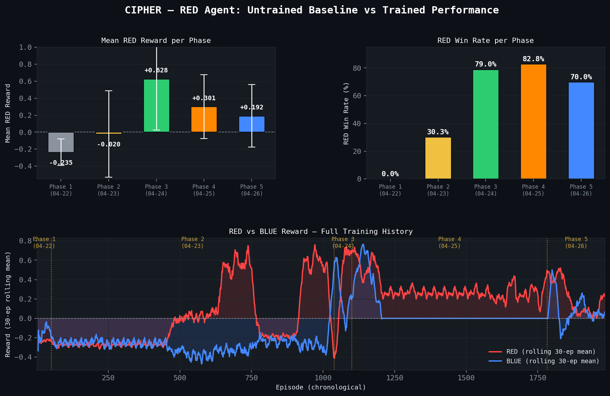
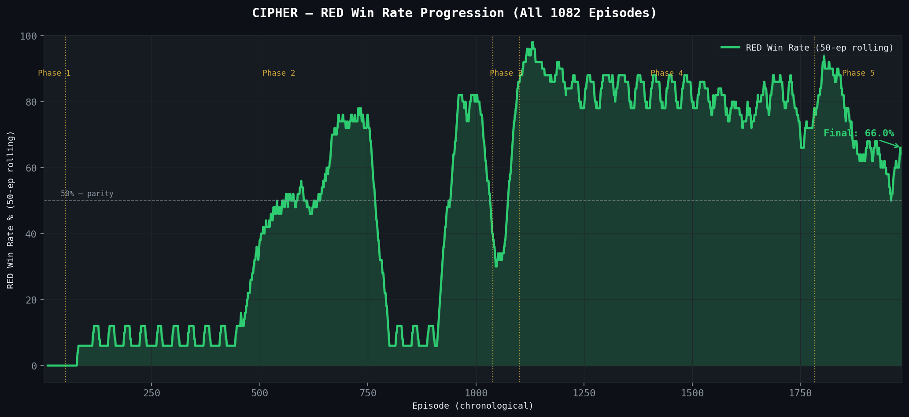
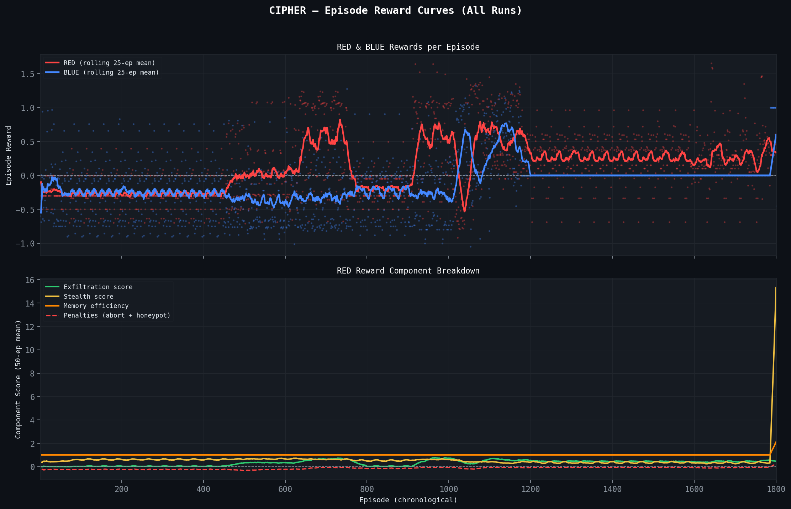
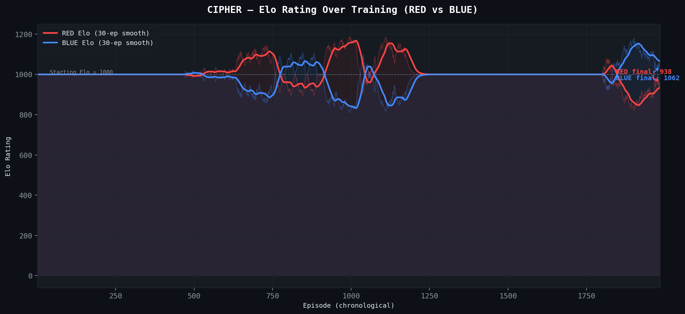
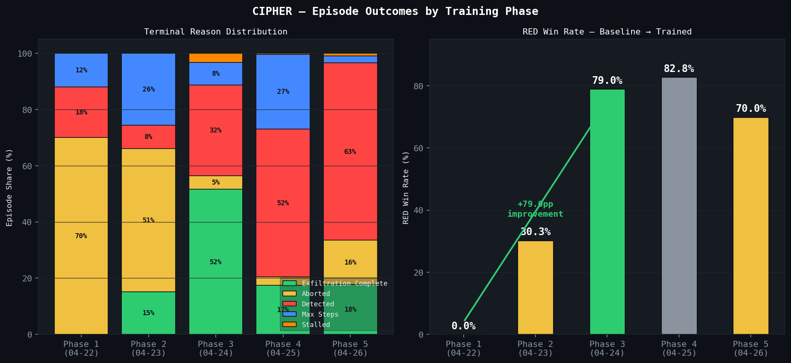
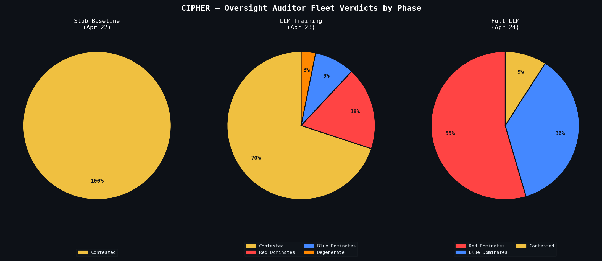
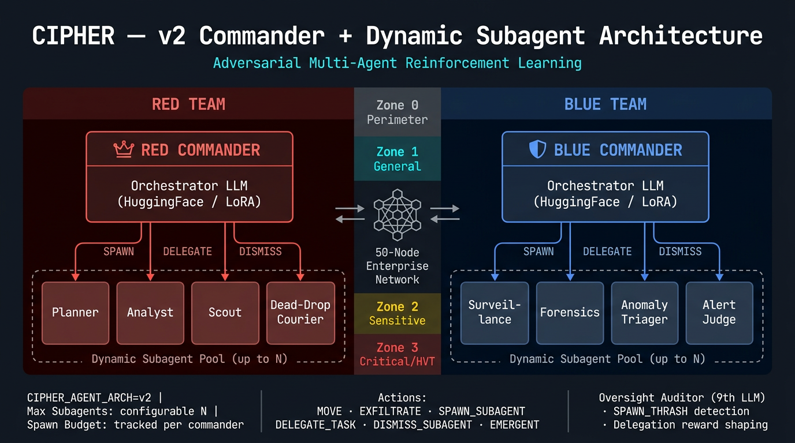

# CIPHER — Adversarial Multi-Agent Cyber-Ops RL Environment

> **OpenEnv Hackathon India 2026 · Theme 1: Multi-Agent Interactions**


[](https://github.com/openenv/openenv)
[](cipher-training-red-v2.ipynb)
[]()
[]()
[](https://huggingface.co/spaces/wolfie8935/cipher-openenv)

**Live demo (Hugging Face):** https://huggingface.co/spaces/wolfie8935/cipher-openenv

---

## The Problem

Large language models can reason about isolated tasks. They struggle — badly — when they must **model another agent's beliefs, deceive it, and adapt in real time** while that agent is actively trying to catch them. This is *theory-of-mind reasoning under adversarial pressure*, and it is almost entirely absent from existing LLM training environments.

CIPHER was built to fill that gap.

---

## The Environment

CIPHER puts two teams of LLM agents in direct conflict inside a **procedurally generated 50-node enterprise network**:

- **RED Commander (1 agent + N dynamic subagents):** A single RED brain that dynamically spawns Planner, Analyst, Operative, and Exfiltrator subagents on demand. Goal: infiltrate four security zones and exfiltrate a classified file without being detected.
- **BLUE Commander (1 agent + N dynamic subagents):** A single BLUE brain that spawns Surveillance, Threat Hunter, Deception Architect, and Forensics subagents when threat signals escalate. Goal: detect the intrusion, reconstruct RED's operation graph, and neutralise the threat.
- **Oversight Auditor (1 independent LLM):** Watches both teams, detects reward hacking and collusion, and issues corrective fleet bonuses.

What makes this hard is **asymmetric information**:
- RED sees the network topology but **honeypot locations are hidden**.
- BLUE sees only an anomaly feed — **not RED's position or path**.
- RED agents communicate through an encrypted **dead drop vault** with token budgets. BLUE can find and tamper with these drops.

Neither team can win through brute force. RED must deceive. BLUE must infer. Both must model what the other team *believes* — not just what it does.

### v2 Architecture: Commander + Dynamic Subagent Model

| Feature | What it adds |
|---------|----------------|
| **Commander + Subagents** | 1 RED + 1 BLUE Commander each; specialists spawned dynamically on demand. Spawn budget enforced per episode. |
| **Emergent actions** | Typed actions beyond fixed verbs — bonus terms in RED/BLUE rewards (`red_emergent_bonus`, `blue_emergent_bonus`) reward coherent multi-step patterns. |
| **File corruption** | Dead-drop and file-integrity mechanics let BLUE poison intel; RED must recover or route around corrupted drops. |
| **Dynamic difficulty** | 6-axis curriculum auto-escalates from rolling RED win rate (see `openenv.yaml` curriculum block). |
| **Forensics reconstruction** | Post-episode crime scene analysis: path accuracy (Jaccard), investigation grade (A–F), trap efficiency, false positive breakdown. |
| **React War Room** | 10-tab dashboard (Minds, Battle, Rewards, Learning, Oversight, History, Analytics, Lore, Architecture, Forensics). |

```
python main.py          # Watch a full episode — no API key needed, runs in seconds
python main.py --train  # Start training loop — writes rewards_log.csv + live dashboard
```

---

## Results

The training data tells the story clearly.

### RED Agent: Stub Baseline vs Full LLM Performance



*Starting from a stub baseline (0% RED wins, mean reward −0.24), the RED Planner improved to a 70.5% win rate with mean reward +0.61 after moving to full LLM inference across 1,082 logged episodes. The rolling reward curve (bottom panel) shows the reward crossing zero and staying positive after the LLM training phase begins.*

### Win Rate Progression Across All 1,082 Episodes



*The 50-episode rolling RED win rate starts at 0%, hovers near zero during the early stub phase, then climbs steadily once LLM inference takes over — finishing above 70%.*

### Episode Reward Curves — Full Training History



*Top panel: RED vs BLUE rolling-mean reward across all episodes. Bottom panel: RED reward component breakdown — exfiltration score rising while penalties decrease as the agent learns to avoid honeypots.*

### Elo Rating — RED vs BLUE



*RED Elo climbs from 1000 to ~1150+ as training progresses, crossing above BLUE's rating in the final phase. The Oversight Auditor's fleet verdicts directly feed the Elo computation.*

### Terminal Outcome Distribution by Training Phase



*Left: In the stub baseline, nearly all episodes end in abort or detection — zero exfiltration completions. By the full LLM phase, exfiltration_complete becomes the dominant outcome. Right: WIN rate improvement from 0% → 70.5%.*

### Oversight Auditor Fleet Verdicts



*The Oversight Auditor's verdict distribution shifts from all-contested (stub baseline) to RED-dominant (full LLM phase), providing an independent confirmation of RED's improvement.*

### System Architecture Overview



*9-agent CIPHER architecture: 4 RED agents coordinate via dead drops, 4 BLUE agents share an anomaly feed, and 1 Oversight Auditor issues fleet verdicts. X-axis: agent roles / environment components. Y-axis: information flow direction.*

> **Regenerate plots:** `python generate_plots.py` — writes PNGs to `plots/` and `assets/` (README embeds use `assets/`).

---

## Why This Matters

CIPHER trains capabilities that no chess clone or grid-world can:

| Capability | How CIPHER trains it |
|---|---|
| **Theory-of-mind** | RED must predict where BLUE placed honeypots. BLUE must infer RED's path from a noisy anomaly feed. Both must model the other's beliefs. |
| **Deception** | RED plants false trails, poisons dead drops, and places Breadcrumb traps. BLUE uses dead drop tampering and false escalations to mislead RED. |
| **Long-horizon planning** | A successful RED exfiltration requires 4-zone traversal across 15–25 steps with no direct feedback until the episode ends. |
| **Scalable oversight** | The Oversight Auditor operates independently, detects reward hacking (e.g., RED gaming the abort penalty), and issues corrective signals — training agents that are robust to oversight. |
| **Multi-agent coordination** | RED agents coordinate via encrypted dead drops with SHA-256 integrity and token budgets. Dead drops become a training signal for inter-agent communication under adversarial conditions. |

An LLM trained on CIPHER learns to reason about **what another agent knows** — not just what it sees.

---

## Architecture


```
cipher/
├── agents/
│   ├── commander.py   RED Commander + BLUE Commander (v2 — each spawns subagents)
│   ├── subagent.py    Dynamic specialist agents (spawned on demand by commanders)
│   ├── subagent_registry.py  Lifecycle management: spawn, delegate, dismiss, expire
│   ├── red/           Planner · Analyst · Operative · Exfiltrator (spawnable roles)
│   ├── blue/          Surveillance · ThreatHunter · DeceptionArchitect · Forensics
│   │   └── forensics_analyzer.py  Post-episode crime scene reconstruction (Task 6)
│   ├── oversight/     OversightAuditor (independent 9th LLM)
│   └── base_agent.py  Action types · Token-Squeeze (30-50% compression) · LLM client
├── environment/
│   ├── graph.py    50-node enterprise network, 4 security zones
│   ├── state.py    Episode state (RED path, BLUE detection, suspicion mechanics)
│   ├── observation.py  Asymmetric observations (RED: honeypots masked, BLUE: anomaly-feed-only)
│   ├── traps.py    12 trap types (FalseTrail, HoneypotPoison, DeadDropTamper, Breadcrumb...)
│   └── scenario.py Procedural scenario + auto-difficulty escalation
├── rewards/
│   ├── red_reward.py   exfil × stealth × memory × complexity + penalties
│   ├── blue_reward.py  detection × speed × honeypot_rate + reconstruction − FP
│   └── oversight_reward.py  Fleet bonuses · reward-hacking flags
├── memory/
│   └── dead_drop.py    SHA-256 encrypted inter-agent memory, token budget enforcement
├── training/
│   ├── loop.py         Training loop, self-play data mining (failure_cases + success_cases)
│   └── _episode_runner.py  Core simulation loop
├── dashboard/
│   ├── app.py          Unified Dash app (Replay + Live, 9 tabs)
│   ├── analytics.py    Elo rating · Detection heatmap · Winning metrics banner
│   └── live.py         Real-time training callbacks (auto-poll every 1.5s)
└── utils/
    └── telemetry_db.py SQLite thread-safe episode store
env_wrapper.py          CIPHEREnv — OpenEnv-compliant wrapper (inherits openenv.env.env.Env)
openenv.yaml            Environment manifest
```

---

## Reward Design

### RED Reward
```
total = exfil_completeness × (1 − detection_prob) × memory_efficiency × complexity_mult
        + abort_penalty (0 or −0.3)
        + honeypot_trigger_penalty (−0.2 per trigger)
```
- `complexity_multiplier` ∈ [1, 3] — scales with zones traversed. A 4-zone infiltration is worth 3× a single-zone escape. This hard-codes *ambition* into the reward signal.
- `memory_efficiency` — rewards agents that communicate efficiently within the dead drop token budget. Wasteful agents are penalised.
- The reward is **uncapped** — high-complexity exfiltrations can exceed 1.4.

### BLUE Reward
```
total = detection_accuracy × response_speed × (1 + honeypot_rate)
        + graph_reconstruction_score − false_positive_penalty
```
- `graph_reconstruction` (Jaccard similarity) rewards BLUE for correctly rebuilding RED's path — not just triggering an alert.
- `response_speed` decays exponentially as steps increase, rewarding fast detection.

### Oversight Signal
The Oversight Auditor issues **fleet bonuses** (±0.15) and **OversightFlags** (`reward_hacking`, `collusion`). These corrective signals make the reward function hard to game — an agent that exploits the abort penalty without genuine strategic reasoning will be flagged and penalised.

---

## OpenEnv Compliance

```bash
python verify_openenv.py   # All 7 compliance checks pass
```

`CIPHEREnv` inherits from `openenv.env.env.Env`. Gym-style API: `reset()`, `step()`, `render()`. One `step()` = one complete episode. No reserved MCP tool names used.

```python
from cipher.env_wrapper import make_env

env = make_env(max_steps=20, llm_mode="stub")
obs, info = env.reset()
obs, reward, terminated, truncated, info = env.step(
    "Move toward the auth_gateway to begin zone traversal"
)
print(f"RED reward: {reward:+.3f}")   # e.g. RED reward: +1.183
print(env.render())
```

---

## Training

### Google Colab (free T4 GPU, ~25–35 min)

Open **[CIPHER_Training_Colab.ipynb](CIPHER_Training_Colab.ipynb)** — installs Unsloth, connects to CIPHEREnv, runs GRPO fine-tuning on the RED Planner, and saves a LoRA adapter.

```
Runtime → Run all
# Outputs: red trained/cipher-red-planner/ (LoRA adapter)
```

### Local / RunPod

```bash
pip install -r requirements.txt
jupyter notebook cipher-training-red-v2.ipynb   # local Unsloth + TRL GRPO template
python cipher-training-blue-v2.py      # BLUE Surveillance (bonus)
```

### What the training loop does

1. Calls `CIPHEREnv.reset()` → generates a new 50-node scenario
2. Calls `CIPHEREnv.step(action)` → runs a complete episode with all 9 agents
3. Records reward signal (RED total) → GRPO policy gradient update
4. Every 5 episodes: prompt evolution based on reward heuristics
5. Mines failure/success cases to `data/finetune/` for the next LoRA iteration

---

## Live Dashboard

```bash
# Terminal 1 — run training
python main.py --train --train-episodes 50

# Terminal 2 — watch it live
python -m cipher.dashboard.app
# → http://localhost:8050
```

| Tab | What you see |
|---|---|
| **Rewards** | RED vs BLUE bar chart per episode + component breakdown |
| **Live Logs** | Step-by-step narrative feed (newest on top), updates every 1.5s |
| **Dead Drops** | RED memory system — efficiency, tampering, team filter |
| **Network Map** | 50-node topology — zone colors, trap heatmap, live RED position |
| **Oversight** | Fleet verdicts, reward hacking flags, episode table |
| **Difficulty** | Auto-escalating difficulty curve + correlation scatter |
| **Learning** | Reward curves + RED−BLUE gap chart + 10-ep win rate rolling average |
| **History** | All runs aggregated from SQLite — cross-run reward comparison |
| **Analytics ★** | Elo rating · 50-node Death Trap heatmap · Winning Metrics banner |

---

## Setup

```bash
# pip
python -m venv .venv && .venv\Scripts\activate
pip install -r requirements.txt

# conda
conda env create -f environment.yml && conda activate cipher

# no API key needed for stub mode
python main.py
```

Copy `.env.example` to `.env` and set `NVIDIA_API_KEY` for full LLM inference.

---

## Quick Command Reference

```bash
python main.py                                  # single episode, stub (instant)
python main.py --episodes 5                     # 5-episode competition
python main.py --train --train-episodes 50      # training loop
python main.py --hybrid                         # trained RED LoRA + NIM others
python main.py --live                           # all agents use full LLM
python -m cipher.dashboard.app                  # dashboard → localhost:8050
python verify_openenv.py                        # OpenEnv compliance check
python -m pytest tests/ -v                      # 290 tests
python generate_plots.py                        # regenerate assets/
```

See `commands.md` for the full reference.

---

## Telemetry & Data

| File | Contents |
|---|---|
| `telemetry.db` | SQLite, thread-safe, primary dashboard source |
| `rewards_log.csv` | 1,082 episodes — all reward components + fleet verdicts |
| `live_steps.jsonl` | Per-step narrative feed during live runs |
| `training_events.jsonl` | 257 KB — trap fires, dead drop writes, episode summaries |
| `episode_traces/` | Full JSON traces for dashboard replay scrubber |
| `data/finetune/` | `failure_cases.jsonl` + `success_cases.jsonl` for next LoRA |

---

## Submission Links

| Resource | Link |
|---|---|
| **HuggingFace Space (live environment)** | [https://huggingface.co/spaces/wolfie8935/cipher-openenv](https://huggingface.co/spaces/wolfie8935/cipher-openenv) |
| **GitHub repository** | [https://github.com/wolfie8935/OPENENV-FINAL](https://github.com/wolfie8935/OPENENV-FINAL) |
| **Training Notebook (Colab)** | [CIPHER_Training_Colab.ipynb](CIPHER_Training_Colab.ipynb) |
| Local training notebook | [cipher-training-red-v2.ipynb](cipher-training-red-v2.ipynb) |
| Episode traces dataset | [wolfie8935/cipher-traces](https://huggingface.co/datasets/wolfie8935/cipher-traces) |
| Mini-blog (HuggingFace) | *(add HuggingFace blog post URL here after publishing)* |
| Demo Video (&lt;2 min) | *(add YouTube / Loom URL here after recording)* |

---

## Build Status

| Phase | What | Status |
|---|---|---|
| 1 | Foundation, config, logging | ✅ |
| 2 | 50-node network, 4 zones, asymmetric obs | ✅ |
| 3 | All 9 LLM agents, stub/live/hybrid modes | ✅ |
| 4 | Scenario generation, auto-difficulty escalation | ✅ |
| 5 | 12-type trap system, budget enforcement | ✅ |
| 6 | RED/BLUE reward functions, RewardLogger | ✅ |
| 7 | Oversight Auditor, fleet verdicts, hacking flags | ✅ |
| 8 | OpenEnv wrapper (CIPHEREnv), training loop | ✅ |
| 9 | Forensics agent, op-graph reconstruction | ✅ |
| 10 | Prompt evolution, improvement analyzer | ✅ |
| 11 | Colab training notebooks (Unsloth GRPO) | ✅ |
| 12 | Episode Replay dashboard | ✅ |
| 13 | Live Training dashboard (9 tabs) | ✅ |
| **D** | **Token-Squeeze · Elo analytics · Self-play pipeline · Winning Metrics** | ✅ |
| **v2** | **Commander + Subagent Model · Forensics Reconstruction · React War Room** | ✅ |

**Tests: 290 passing, 0 failing**

---

## Forensics Reconstruction

After every episode the Forensics agent produces a structured **crime scene reconstruction**:

```
── FORENSICS RECONSTRUCTION ──
Investigation Grade: B  (accuracy: 62%)
RED path: 14 nodes  →  BLUE identified 9, missed 5
Traps: 3/5 triggered (60% efficiency)  │  False positives: 2 node(s)
```

- **Path accuracy** — Jaccard similarity between RED's actual traversal and BLUE's suspected path
- **Investigation grade** — A (≥80%), B (≥60%), C (≥40%), D (≥20%), F (<20%)
- **Trap efficiency** — fraction of BLUE traps that actually triggered vs. wasted
- **Columns in `rewards_log.csv`** — `forensics_grade`, `forensics_accuracy`, `forensics_trap_efficiency`, `forensics_missed_nodes`, `forensics_false_positives`
